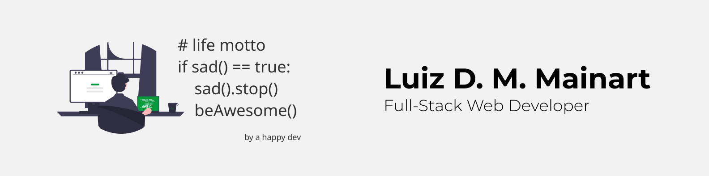

# Luiz D. M. Mainart
### Full-stack freelancer developer

⤷ I'm a developer that loves helping startups to develop their business ideas.

      

⚐ Based in Brazil

ϟ Currently building a django backend for a new company

 ## Skills
             
