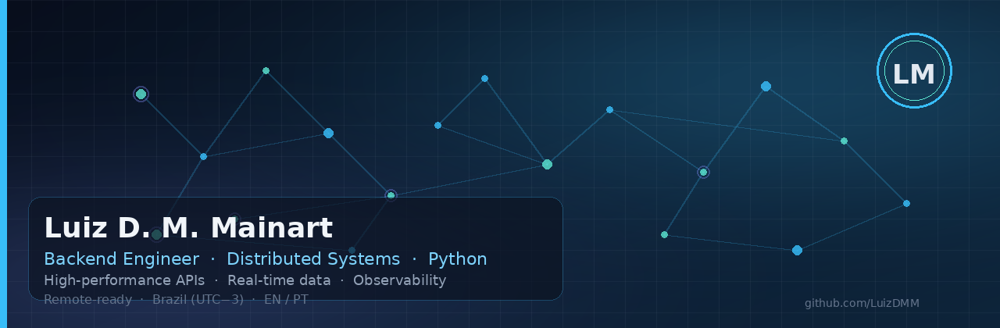

  

<h1 align="center">Luiz D. M. Mainart</h1>

  <strong>Backend Engineer</strong> · Distributed systems · High-performance Python 
  Remote-ready · Brazil (UTC−3) · English / Portuguese

  <a href="https://www.linkedin.com/in/luiz-mainart/">LinkedIn</a> ·
  <a href="mailto:luizdmmainart@gmail.com">Email</a> ·
  <a href="https://github.com/LuizDMM">GitHub</a>

---

### What I build
- **High-throughput backends** — APIs, async workers, event buses (RabbitMQ/Celery), Postgres
- **Real-time / data-heavy systems** — WebSockets, market-data style ingestion, reliability under load
- **Observability** — OpenTelemetry, Prometheus/Grafana; past OSS work on LLM observability (OpenLLMetry)
- **Cloud-native delivery** — Docker, Kubernetes, GCP (also comfortable with AWS basics + CI)

### Stack

  

`Python` · `Django` / `DRF` · `TypeScript` · `PostgreSQL` · `Redis` · `RabbitMQ` · `Celery` · `Docker` · `Kubernetes` · `GCP` · `OpenTelemetry`

### Selected proof (public)
| Signal | Detail |
|--------|--------|
| **OpenLLMetry** | Contributed to [traceloop/openllmetry](https://github.com/traceloop/openllmetry) (OpenTelemetry-based LLM observability). Prefer upstream PRs over fork pins. |
| **Production systems** | Multi-exchange trading backends, real-time feeds, cloud-native deploys — details on [LinkedIn](https://www.linkedin.com/in/luiz-mainart/) / résumé |

### Currently
- Full-time engineering (Human Data / AI systems evaluation workflows)
- Light contractor backend work on the side

### Looking for
**Senior / strong Backend or Platform** roles — **remote international** (US/EU timezone overlap OK, async-friendly teams OK).

---

  
  

