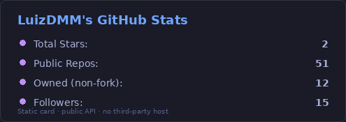
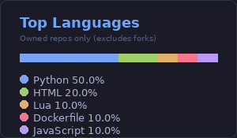

<!--
GitHub profile README for https://github.com/LuizDMM/LuizDMM

Files to commit in this repo:
  - social_banner.png  (copy from hero-banner.png)
  - stats.png          (static — do NOT use github-readme-stats.vercel.app)
  - top-langs.png      (static)
  - README.md          (this file)

Why static cards?
  Official https://github-readme-stats.vercel.app is often DEPLOYMENT_PAUSED / rate-limited.
  Local PNG in the profile repo always renders on GitHub.
-->

  

<h1 align="center">Luiz D. M. Mainart</h1>

  <strong>Backend Engineer</strong> · Distributed systems · High-performance Python 
  Remote-ready · Brazil (UTC−3) · English (C1) / Portuguese

  <a href="https://www.linkedin.com/in/luiz-mainart/">LinkedIn</a> ·
  <a href="mailto:luizdmmainart@gmail.com">Email</a> ·
  <a href="https://github.com/LuizDMM">GitHub</a>

---

### What I build
- **High-throughput backends** — APIs, async workers, event buses (RabbitMQ/Celery), Postgres
- **Real-time / data-heavy systems** — WebSockets, market-data style ingestion, reliability under load
- **Observability** — OpenTelemetry, Prometheus/Grafana; past OSS work on LLM observability (OpenLLMetry)
- **Cloud-native delivery** — Docker, Kubernetes, GCP (also comfortable with AWS basics + CI)

### Stack

  

`Python` · `Django` / `DRF` · `TypeScript` · `PostgreSQL` · `Redis` · `RabbitMQ` · `Celery` · `Docker` · `Kubernetes` · `GCP` · `OpenTelemetry`

### Selected proof (public)
| Signal | Detail |
|--------|--------|
| **OpenLLMetry** | Contributed to [traceloop/openllmetry](https://github.com/traceloop/openllmetry) (OpenTelemetry-based LLM observability). Prefer upstream PRs over fork pins. |
| **Production systems** | Multi-exchange trading backends, real-time feeds, cloud-native deploys — details on [LinkedIn](https://www.linkedin.com/in/luiz-mainart/) / résumé |

### Currently
- Full-time engineering (Human Data / AI systems evaluation workflows)
- Light contractor backend work on the side
- Preparing a **public systems project** (async job platform / reliability-focused) for portfolio pin

### Looking for
**Senior / strong Backend or Platform** roles — **remote international** (US/EU timezone overlap OK, async-friendly teams OK).

---

  
  

<!--
Stats/langs are STATIC images in this repo (stats.png, top-langs.png).
Do not switch back to github-readme-stats.vercel.app — public instance is frequently paused.

To refresh later (optional):
  regenerate from GH public API and overwrite stats.png / top-langs.png
-->
